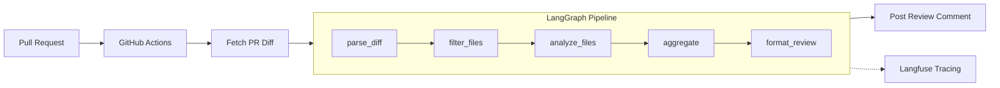

# AI Code Review Agent

**An autonomous AI agent that reviews GitHub Pull Requests for bugs, security vulnerabilities, and code quality issues — with built-in evaluation, observability, and honest benchmarks.**

[](https://www.python.org/downloads/)
[](https://github.com/langchain-ai/langgraph)
[](https://github.com/features/actions)
[](LICENSE)
[](https://code-review-ai-agent.streamlit.app/)

**[Live Dashboard →](https://code-review-ai-agent.streamlit.app/)**

---

## What This Is

An end-to-end AI agent system with evaluation, observability, and benchmarking that demonstrates how LLM-based code review works in practice — and where it breaks. This is not a CodeRabbit competitor. It's a portfolio project that honestly explores the capabilities and limitations of using LLMs for automated code review, backed by reproducible metrics and transparent failure analysis.

The agent runs as a GitHub Action, analyzes each file in a PR independently using Llama 3.3 70B via Groq, and posts structured review comments with severity levels, confidence scores, and suggested fixes. Every LLM call is traced with Langfuse for full observability into cost, latency, and token usage.

---

## Architecture



| Node | What it does |
|---|---|
| **parse_diff** | Split unified diff into per-file chunks |
| **filter_files** | Skip non-code files (.lock, .md, .json, .yaml, images) |
| **analyze_files** | LLM review per file via Llama 3.3 70B |
| **aggregate** | Validate and combine findings via Pydantic |
| **format_review** | Render GitHub markdown comment grouped by severity |

**Pipeline State** flows through a `ReviewState` TypedDict:

```
pr_url → raw_diff → file_diffs → filtered_files → findings → summary → formatted_review
```

Each node is decorated with `@observe` for Langfuse tracing. The `analyze_files` node calls the LLM once per file with a structured JSON schema, then validates output through a 3-tier extraction fallback (direct parse → markdown fence extraction → regex).

---

## How It Works

1. **A PR is opened or updated** on a repository with the GitHub Actions workflow installed
2. **GitHub Actions triggers** `scripts/run_review.py`, which fetches the unified diff via the GitHub API
3. **The LangGraph pipeline** processes the diff through 5 nodes:
   - Parses the diff into per-file chunks
   - Filters out non-code files (lockfiles, images, config)
   - Sends each code file to Llama 3.3 70B for analysis with a structured prompt
   - Validates and aggregates findings using Pydantic models
   - Formats a markdown review grouped by severity
4. **The agent posts a review comment** on the PR with findings organized as critical/warning/suggestion, each with file location, category, confidence score, and a suggested fix

You can also run it locally against any public PR:

```bash
python -m src.agent.main --pr-url "https://github.com/owner/repo/pull/123"
```

---

## Evaluation Results

The agent is evaluated against a benchmark suite of **10 synthetic PR diffs containing 30 known bugs** across security vulnerabilities, logic errors, and common bug patterns.

| Metric | Score |
|---|---|
| **Precision** | 68.2% |
| **Recall** | 50.0% |
| **F1 Score** | 57.7% |
| **False Positive Rate** | 31.8% |

| Category | Expected | Detected | Accuracy |
|---|---|---|---|
| Security | 21 | 10 | 47.6% |
| Bug | 6 | 3 | 50.0% |
| Logic | 3 | 2 | 66.7% |

**Benchmark details:** 52,340 tokens total | 94.7s latency | ~$0.031 estimated cost at Groq pricing

<details>
<summary><strong>Benchmark breakdown by diff</strong></summary>

| Benchmark | Expected | TP | FP | FN | Precision | Recall |
|---|---|---|---|---|---|---|
| sql_injection | 2 | 1 | 0 | 1 | 100% | 50.0% |
| null_reference | 1 | 0 | 1 | 1 | 0% | 0% |
| off_by_one | 3 | 1 | 0 | 2 | 100% | 33.3% |
| hardcoded_secret | 5 | 3 | 1 | 2 | 75.0% | 60.0% |
| buffer_overflow | 3 | 2 | 0 | 1 | 100% | 66.7% |
| insecure_deserialization | 5 | 3 | 1 | 2 | 75.0% | 60.0% |
| logic_error | 3 | 2 | 1 | 1 | 66.7% | 66.7% |
| missing_validation | 4 | 2 | 1 | 2 | 66.7% | 50.0% |
| race_condition | 2 | 0 | 1 | 2 | 0% | 0% |
| xss_vulnerability | 2 | 1 | 1 | 1 | 50.0% | 50.0% |

</details>

### Limitations

This section exists because honest evaluation matters more than impressive numbers.

- **False positive rate of 32%** means roughly 1 in 3 findings is noise. In a production setting, this erodes developer trust quickly.

- **Security recall at 48%** — the agent misses more than half of security vulnerabilities. LLM-based vulnerability detection has fundamental limitations: GPT-4 scored just 13% on the [SecLLMHolmes benchmark](https://arxiv.org/abs/2401.03489) for real-world vulnerability detection. This agent uses a smaller model (Llama 3.3 70B) on synthetic examples, so the 48% figure is not transferable to production codebases.

- **Failure modes observed:**
  - Large files (>500 lines of diff) degrade quality as context fills up
  - Complex multi-file logic bugs are missed because files are analyzed independently
  - Race conditions and concurrency bugs were completely missed (0% recall on synthetic examples)
  - The agent has no codebase context beyond the diff — it can't reason about call sites, types, or invariants

- **This is LLM-assisted triage, not automated scanning.** The agent is best understood as a first-pass reviewer that catches surface-level issues and flags areas for human attention. It does not replace SAST tools, linters, or human review. The value is in reducing the reviewer's search space, not in making definitive security assessments.

---

## Observability

Every pipeline run is traced with [Langfuse](https://langfuse.com), providing visibility into:

- Per-node execution time and token usage
- Per-file LLM call cost breakdown
- Finding distribution across severity and category
- Error tracking for failed parses or API issues

Explore traces interactively on the **[live dashboard](https://code-review-ai-agent.streamlit.app/)** (Observability tab).

Traces can also be exported as JSON for the Streamlit dashboard:

```bash
python -m src.agent.main --pr-url <URL> --export-trace
```

---

## Tech Stack

| Tool | Purpose | Why This One |
|---|---|---|
| [LangGraph](https://github.com/langchain-ai/langgraph) | Agent orchestration | Explicit state machine with typed state — easier to debug and test than chain-based approaches |
| [Groq](https://groq.com) (Llama 3.3 70B) | LLM inference | Free tier (1K req/day), fast inference, strong code understanding for an open model |
| [Langfuse](https://langfuse.com) | Observability & tracing | Open-source, self-hostable, first-class LangGraph integration via `@observe` |
| [Pydantic](https://docs.pydantic.dev) | Structured output validation | Type-safe finding models with automatic validation and serialization |
| [GitHub Actions](https://github.com/features/actions) | CI/CD trigger | Zero infrastructure — runs on PR events without needing a webhook server |
| [Streamlit](https://streamlit.io) | [Live dashboard](https://code-review-ai-agent.streamlit.app/) | Fastest path from Python to interactive web app for showcasing results |
| [httpx](https://www.python-httpx.org) | Async HTTP | Modern async client for GitHub API calls with proper error handling |
| [pytest](https://pytest.org) | Testing | Async test support, good fixture model for benchmark evaluation tests |

---

## Quick Start

### Prerequisites

- Python 3.11+
- A [Groq API key](https://console.groq.com) (free tier)
- A GitHub personal access token (for reviewing private repos)

### Setup

```bash
# Clone the repository
git clone https://github.com/rishimule/ai-code-review-agent.git
cd ai-code-review-agent

# Install dependencies
pip install -e .

# Configure environment
cp .env.example .env
# Edit .env with your API keys:
#   GROQ_API_KEY=gsk_...
#   GITHUB_TOKEN=ghp_...          (optional, for private repos)
#   LANGFUSE_PUBLIC_KEY=pk-lf-... (optional, for tracing)
#   LANGFUSE_SECRET_KEY=sk-lf-... (optional, for tracing)
```

### Run

```bash
# Review a PR
python -m src.agent.main --pr-url "https://github.com/owner/repo/pull/123"

# Run evaluation benchmarks
python -m src.eval.evaluator

# Compare models
python -m src.eval.compare_models --models llama-3.3-70b-versatile,llama-3.1-8b-instant

# Run tests
pytest

# Launch the dashboard locally
streamlit run dashboard/app.py
# Or visit the live dashboard: https://code-review-ai-agent.streamlit.app/
```

---

## Deployment

To set up automated PR reviews on your own repository:

1. **Fork this repository** (or copy the workflow file)

2. **Add repository secrets** in Settings → Secrets and variables → Actions:
   - `GROQ_API_KEY` — your Groq API key

3. **Copy the workflow** to your target repo:
   ```
   .github/workflows/code-review.yml
   ```

4. **Open a PR** — the agent will automatically run and post a review comment

The workflow triggers on `pull_request` events (opened and synchronized) for code files only. It uses `GITHUB_TOKEN` provided by Actions for posting comments — no additional token setup needed for public repos.

### Supported Languages

Python, JavaScript, TypeScript, Go, Rust, Java, Ruby, C/C++, C#, PHP, Swift, Kotlin, Scala, Shell, SQL

Non-code files (lockfiles, markdown, JSON, YAML, images, fonts) are automatically skipped.

---

## Competitive Landscape

Several production tools exist in this space:

| Tool | Approach |
|---|---|
| [CodeRabbit](https://coderabbit.ai) | Commercial, full-repo context, incremental learning |
| [GitHub Copilot Code Review](https://github.com/features/copilot) | Integrated into GitHub, backed by GPT-4 |
| [Qodo PR-Agent](https://github.com/Codium-ai/pr-agent) | Open-source, multi-model, extensive customization |

**What this project demonstrates differently:**

- **Evaluation rigor** — A reproducible benchmark suite with ground truth, not just "it found some issues." The metrics are computed against known bugs with matching logic, and the results include false positives and missed findings.

- **Honest limitations** — Production tools market recall and precision without publishing methodology. This project documents exactly what the agent catches, what it misses, and why. The limitations section exists because understanding failure modes is more valuable than inflated metrics.

- **Full observability** — Every LLM call is traced with cost, latency, and token breakdowns. This demonstrates the engineering practice of treating LLM calls as observable operations, not black boxes.

- **Transparent architecture** — The LangGraph pipeline is explicit about state transitions and can be inspected, tested, and extended node by node. The evaluation harness tests the full pipeline end-to-end against known bugs, not just prompt quality.

This is a demonstration of how to build, evaluate, and operate an LLM-based agent — not a production code review tool.

---

## What I'd Do Differently / Next Steps

If this were a production system, here's what I'd prioritize:

**Accuracy improvements**
- **SAST integration** — Pipe Semgrep or CodeQL findings into the LLM prompt as grounding context. LLMs are better at explaining and triaging known issues than discovering novel vulnerabilities from scratch.
- **Codebase indexing** — Build a vector index of the repository so the agent can retrieve relevant type definitions, call sites, and invariants when reviewing a file. Single-file analysis misses cross-file bugs.
- **Multi-pass review** — A second LLM pass that reviews its own findings and filters low-confidence noise would reduce the 32% false positive rate.

**Feedback loop**
- **Developer feedback collection** — Track which findings developers dismiss vs. act on, and use that signal to tune prompts and confidence thresholds.
- **Fine-tuning** — With enough labeled review data, fine-tune a smaller model on the specific task of code review to improve precision without the cost of a 70B model.

**Infrastructure**
- **Caching** — Cache analysis results for unchanged files across PR updates to reduce redundant LLM calls.
- **Parallel file analysis** — The current sequential-with-rate-limiting approach is safe but slow. With a paid API tier, files could be analyzed concurrently.
- **Webhook server** — For orgs reviewing >50 PRs/day, a persistent service with queuing would be more efficient than per-PR GitHub Actions runs.

---

## License

[MIT](LICENSE)
