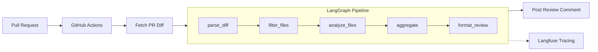

<div align="center">

# AI Code Review Agent

**An autonomous AI agent that reviews GitHub Pull Requests for bugs, security vulnerabilities, and code quality issues — with built-in evaluation, observability, and honest benchmarks.**

[](https://www.python.org/downloads/)
[](https://github.com/langchain-ai/langgraph)
[](https://groq.com)
[](https://github.com/features/actions)
[](LICENSE)

<br>

[**Live Dashboard**](https://code-review-ai-agent.streamlit.app/) &nbsp;&middot;&nbsp; [**Project Blog**](https://rishimule.github.io/ai-code-review-agent/) &nbsp;&middot;&nbsp; [**How It Works**](#architecture)

<br>

   

</div>

<br>

## What This Is

An end-to-end AI agent system with evaluation, observability, and benchmarking that demonstrates how LLM-based code review works in practice — **and where it breaks**.

This is not a CodeRabbit competitor. It's a portfolio project that honestly explores the capabilities and limitations of using LLMs for automated code review, backed by reproducible metrics and transparent failure analysis.

> The agent runs as a GitHub Action, analyzes each file in a PR independently using Llama 3.3 70B via Groq, and posts structured review comments with severity levels, confidence scores, and suggested fixes. Every LLM call is traced with Langfuse for full observability.

<br>

## Architecture



| Node | What It Does |
|:---|:---|
| `parse_diff` | Split unified diff into per-file chunks |
| `filter_files` | Skip non-code files (.lock, .md, .json, .yaml, images) |
| `analyze_files` | LLM review per file via Llama 3.3 70B |
| `aggregate` | Validate and combine findings via Pydantic |
| `format_review` | Render GitHub markdown comment grouped by severity |

**Pipeline State** flows through a `ReviewState` TypedDict:

```
pr_url → raw_diff → file_diffs → filtered_files → findings → summary → formatted_review
```

Each node is decorated with `@observe` for Langfuse tracing. The `analyze_files` node calls the LLM once per file with a structured JSON schema, then validates output through a **3-tier extraction fallback** (direct parse → markdown fence extraction → regex).

<br>

## How It Works

```
1. PR opened/updated  →  2. GitHub Actions triggers  →  3. LangGraph pipeline  →  4. Review comment posted
```

1. **A PR is opened or updated** on a repository with the GitHub Actions workflow installed
2. **GitHub Actions triggers** `scripts/run_review.py`, which fetches the unified diff via the GitHub API
3. **The LangGraph pipeline** processes the diff through 5 nodes:
   - Parses the diff into per-file chunks
   - Filters out non-code files (lockfiles, images, config)
   - Sends each code file to Llama 3.3 70B for analysis with a structured prompt
   - Validates and aggregates findings using Pydantic models
   - Formats a markdown review grouped by severity
4. **The agent posts a review comment** on the PR with findings organized as critical / warning / suggestion, each with file location, category, confidence score, and a suggested fix

**Run locally** against any public PR:

```bash
python -m src.agent.main --pr-url "https://github.com/owner/repo/pull/123"
```

<br>

## Evaluation Results

The agent is evaluated against a benchmark suite of **10 synthetic PR diffs containing 30 known bugs** across security vulnerabilities, logic errors, and common bug patterns.

### Aggregate Metrics

| Metric | Score | |
|:---|:---|:---|
| **Precision** | 68.2% | How many findings are real issues |
| **Recall** | 50.0% | How many real issues are found |
| **F1 Score** | 57.7% | Harmonic mean of precision & recall |
| **False Positive Rate** | 31.8% | ~1 in 3 findings is noise |

### Per-Category Accuracy

| Category | Expected | Detected | Accuracy |
|:---|:---:|:---:|:---|
| Security | 21 | 10 | `47.6%` |
| Bug | 6 | 3 | `50.0%` |
| Logic | 3 | 2 | `66.7%` |

> **Benchmark cost:** 52,340 tokens &middot; 94.7s latency &middot; ~$0.031 estimated cost at Groq pricing

<details>
<summary><strong>Per-benchmark breakdown</strong></summary>

<br>

| Benchmark | TP | FP | FN | Precision | Recall | Missed |
|:---|:---:|:---:|:---:|:---:|:---:|:---|
| `buffer_overflow` | 2 | 0 | 1 | 100% | 66.7% | sprintf without size limit |
| `hardcoded_secret` | 3 | 1 | 2 | 75.0% | 60.0% | JWT secret, SMTP password |
| `insecure_deserialization` | 3 | 1 | 2 | 75.0% | 60.0% | pickle.loads on backup/webhook |
| `logic_error` | 2 | 1 | 1 | 66.7% | 66.7% | OR instead of AND |
| `missing_validation` | 2 | 1 | 2 | 66.7% | 50.0% | Path traversal, input format |
| `sql_injection` | 1 | 0 | 1 | 100% | 50.0% | f-string query in get_user |
| `xss_vulnerability` | 1 | 1 | 1 | 50.0% | 50.0% | Stored XSS without escaping |
| `off_by_one` | 1 | 0 | 2 | 100% | 33.3% | Integer division, negative index |
| `null_reference` | 0 | 1 | 1 | 0% | 0% | NoneType subscript on payment |
| `race_condition` | 0 | 1 | 2 | 0% | 0% | check_and_increment, transfer |

</details>

<br>

### Limitations

> This section exists because **honest evaluation matters more than impressive numbers.**

- **False positive rate of 32%** — roughly 1 in 3 findings is noise. In a production setting, this erodes developer trust quickly.

- **Security recall at 48%** — the agent misses more than half of security vulnerabilities. For context, GPT-4 scored just 13% on the [SecLLMHolmes benchmark](https://arxiv.org/abs/2401.03489) for real-world vulnerability detection. This agent uses a smaller model on synthetic examples, so the 48% figure is not transferable to production codebases.

- **Failure modes observed:**
  - Large files (>500 lines of diff) degrade quality as context fills up
  - Complex multi-file logic bugs are missed because files are analyzed independently
  - Race conditions and concurrency bugs were completely missed (0% recall)
  - The agent has no codebase context beyond the diff — it can't reason about call sites, types, or invariants

- **This is LLM-assisted triage, not automated scanning.** The agent is best understood as a first-pass reviewer that catches surface-level issues and flags areas for human attention. It does not replace SAST tools, linters, or human review.

<br>

## Observability

Every pipeline run is traced with [Langfuse](https://langfuse.com), providing visibility into:

- **Per-node execution time** and token usage
- **Per-file LLM call** cost breakdown
- **Finding distribution** across severity and category
- **Error tracking** for failed parses or API issues

Explore traces interactively on the **[live dashboard](https://code-review-ai-agent.streamlit.app/)** (Observability tab).

```bash
# Export traces as JSON
python -m src.agent.main --pr-url <URL> --export-trace
```

<br>

## Tech Stack

| Tool | Purpose | Why This One |
|:---|:---|:---|
| [LangGraph](https://github.com/langchain-ai/langgraph) | Agent orchestration | Explicit state machine with typed state — easier to debug and test than chain-based approaches |
| [Groq](https://groq.com) (Llama 3.3 70B) | LLM inference | Free tier (1K req/day), fast inference, strong code understanding for an open model |
| [Langfuse](https://langfuse.com) | Observability & tracing | Open-source, self-hostable, first-class LangGraph integration via `@observe` |
| [Pydantic](https://docs.pydantic.dev) | Structured output | Type-safe finding models with automatic validation and serialization |
| [GitHub Actions](https://github.com/features/actions) | CI/CD trigger | Zero infrastructure — runs on PR events without needing a webhook server |
| [Streamlit](https://streamlit.io) | [Live dashboard](https://code-review-ai-agent.streamlit.app/) | Fastest path from Python to interactive web app for showcasing results |
| [httpx](https://www.python-httpx.org) | Async HTTP | Modern async client for GitHub API calls with proper error handling |
| [pytest](https://pytest.org) | Testing | Async test support, good fixture model for benchmark evaluation tests |

<br>

## Quick Start

### Prerequisites

- Python 3.11+
- A [Groq API key](https://console.groq.com) (free tier)
- A GitHub personal access token (for reviewing private repos)

### Setup

```bash
git clone https://github.com/rishimule/ai-code-review-agent.git
cd ai-code-review-agent
pip install -e .

cp .env.example .env
# Edit .env with your API keys:
#   GROQ_API_KEY=gsk_...
#   GITHUB_TOKEN=ghp_...          (optional, for private repos)
#   LANGFUSE_PUBLIC_KEY=pk-lf-... (optional, for tracing)
#   LANGFUSE_SECRET_KEY=sk-lf-... (optional, for tracing)
```

### Run

```bash
# Review a PR
python -m src.agent.main --pr-url "https://github.com/owner/repo/pull/123"

# Run evaluation benchmarks
python -m src.eval.evaluator

# Compare models
python -m src.eval.compare_models --models llama-3.3-70b-versatile,llama-3.1-8b-instant

# Run tests
pytest

# Launch the dashboard locally
streamlit run dashboard/app.py
```

<br>

## Deployment

To set up automated PR reviews on your own repository:

1. **Fork this repository** (or copy the workflow file)

2. **Add repository secrets** in Settings → Secrets and variables → Actions:
   - `GROQ_API_KEY` — your Groq API key

3. **Copy the workflow** to your target repo:
   ```
   .github/workflows/code-review.yml
   ```

4. **Open a PR** — the agent will automatically run and post a review comment

The workflow triggers on `pull_request` events (opened and synchronized) for code files only. It uses `GITHUB_TOKEN` provided by Actions for posting comments — no additional token setup needed for public repos.

**Supported languages:** Python, JavaScript, TypeScript, Go, Rust, Java, Ruby, C/C++, C#, PHP, Swift, Kotlin, Scala, Shell, SQL

<br>

## Competitive Landscape

| Tool | Approach |
|:---|:---|
| [CodeRabbit](https://coderabbit.ai) | Commercial, full-repo context, incremental learning |
| [GitHub Copilot Code Review](https://github.com/features/copilot) | Integrated into GitHub, backed by GPT-4 |
| [Qodo PR-Agent](https://github.com/Codium-ai/pr-agent) | Open-source, multi-model, extensive customization |

**What this project demonstrates differently:**

- **Evaluation rigor** — A reproducible benchmark suite with ground truth, not just "it found some issues." The metrics are computed against known bugs with matching logic, and the results include false positives and missed findings.

- **Honest limitations** — Production tools market recall and precision without publishing methodology. This project documents exactly what the agent catches, what it misses, and why.

- **Full observability** — Every LLM call is traced with cost, latency, and token breakdowns. This demonstrates the engineering practice of treating LLM calls as observable operations, not black boxes.

- **Transparent architecture** — The LangGraph pipeline is explicit about state transitions and can be inspected, tested, and extended node by node.

<br>

## What I'd Do Differently / Next Steps

**Accuracy improvements**
- **SAST integration** — Pipe Semgrep or CodeQL findings into the LLM prompt as grounding context
- **Codebase indexing** — Build a vector index for retrieving type definitions, call sites, and invariants
- **Multi-pass review** — A second LLM pass to self-critique and filter low-confidence noise

**Feedback loop**
- **Developer feedback collection** — Track which findings developers dismiss vs. act on
- **Fine-tuning** — With enough labeled data, fine-tune a smaller model on the specific task

**Infrastructure**
- **Caching** — Cache analysis results for unchanged files across PR updates
- **Parallel file analysis** — Concurrent analysis with a paid API tier
- **Webhook server** — For high-volume orgs, a persistent service with queuing

<br>

## Project Structure

```
src/
  agent/          LangGraph pipeline nodes and graph definition
  models/         Pydantic models for review findings
  github_client/  GitHub API interaction (fetching diffs, posting comments)
  prompts/        Prompt templates
  eval/           Evaluation harness and benchmark suite
  observability/  Langfuse tracing, cost tracking, trace export
benchmarks/       Known-buggy PR diffs and ground truth
dashboard/        Streamlit app
scripts/          GitHub Actions entry point
tests/            Unit and integration tests
.github/          GitHub Actions workflow
```

<br>

## License

[MIT](LICENSE)
